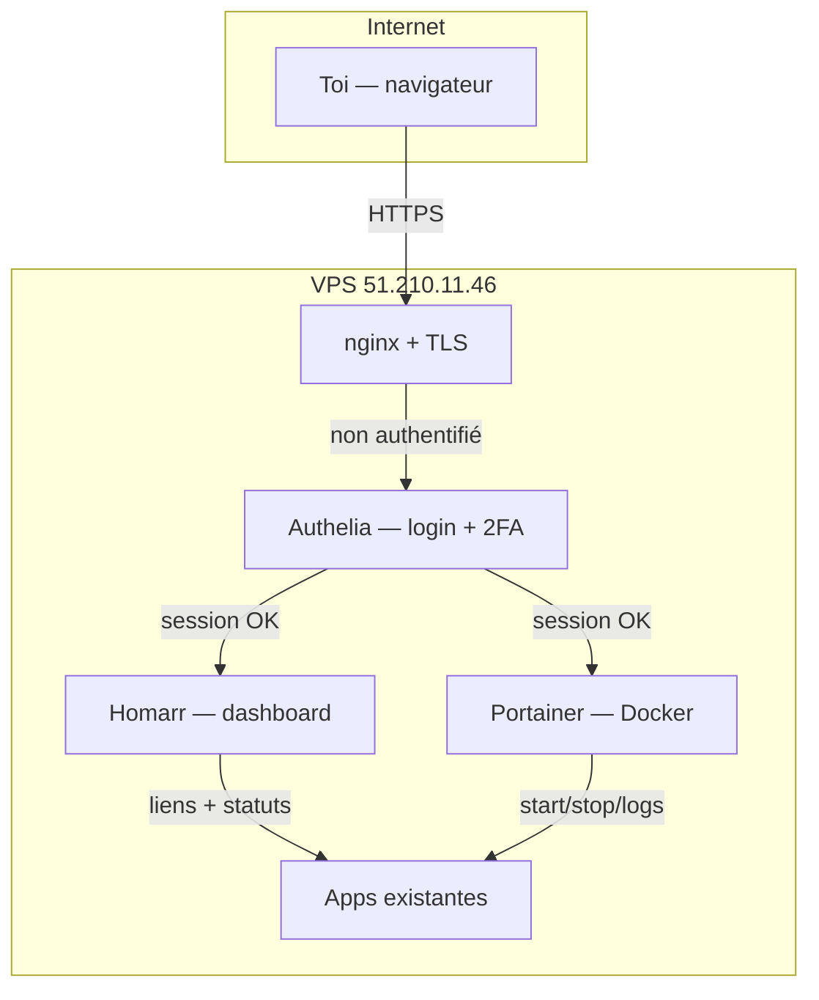

# Master Control Panel — `master.pixelbrain.fr`

Hub sécurisé pour visualiser et gérer apps + VPS. Accès **solo** (toi uniquement).

---

## Solution recommandée

**Authelia + Homarr + Portainer** derrière nginx, sur ton VPS existant.



### Composants

| Service | Rôle | URL |
|---------|------|-----|
| **Authelia** | Porte d’entrée — login, 2FA (TOTP), sessions | `master.pixelbrain.fr/auth` |
| **Homarr** | Dashboard visuel — apps, liens, widgets statut | `master.pixelbrain.fr` |
| **Portainer CE** | Gestion Docker — conteneurs, logs, volumes, images | `master.pixelbrain.fr/portainer` |

### Pourquoi ce choix

- **Gratuit** et self-hosted (comme Infisical)
- **Un seul login** pour tout le panel
- **2FA** optionnel (Google Authenticator)
- **Homarr** : vue d’ensemble sans coder un dashboard
- **Portainer** : gestion VPS réelle (restart container, voir logs)
- S’intègre à ton **nginx** existant (`pixelbrain-nginx`)

---

## Sécurité (accès solo)

| Mesure | Détail |
|--------|--------|
| Utilisateur unique | 1 compte Authelia (`yaki` / ton email) |
| Mot de passe fort | Hash Argon2id, stocké dans Infisical |
| 2FA TOTP | Recommandé — scan QR au 1er login |
| Forward auth | nginx redirige vers Authelia si pas de session |
| Cookies sécurisés | `Secure`, `HttpOnly`, domaine `pixelbrain.fr` |
| Rate limit | Authelia bloque brute-force (3 essais / 30s) |
| Pas d’inscription publique | Registration désactivée |

### Ce qui reste public (inchangé)

- `card.pixelbrain.fr`, `echowork.*`, etc. — apps prod
- `secrets.pixelbrain.fr` — Infisical (auth séparée)

### Option renforcement (plus tard)

- Restreindre Authelia à ton IP fixe (si tu en as une)
- Cloudflare Access en couche supplémentaire
- WireGuard VPN pour accès admin sans exposition

---

## Alternative A — Plus simple, moins puissant

**oauth2-proxy + Google** (allowlist `bouchaouradam@gmail.com`)

- ✅ Setup rapide (~30 min)
- ❌ Dépend de Google
- ❌ Pas de gestion Docker intégrée (juste des liens)

---

## Alternative B — Zero-trust externe

**Cloudflare Tunnel + Access**

- ✅ Très sécurisé, pas de port ouvert en plus
- ❌ DNS chez Cloudflare requis
- ❌ Compte Cloudflare

---

## Alternative C — Dashboard custom (repo Master)

App Next.js maison + NextAuth Google (email allowlist)

- ✅ 100 % sur mesure
- ❌ Semaines de dev pour égaler Portainer + Homarr

---

## Déploiement prévu (solution recommandée)

```
Master/
├── deploy/
│   └── master-panel/
│       ├── docker-compose.yml    # authelia, homarr, portainer
│       ├── authelia/
│       │   ├── configuration.yml
│       │   └── users_database.yml
│       └── README.md
└── reverse-proxy/conf.d/
    └── master.conf               # nginx + forward-auth
```

### Étapes

1. DNS OVH : `master.pixelbrain.fr` → `51.210.11.46`
2. Certificat Let's Encrypt
3. `docker compose up` (Authelia + Homarr + Portainer)
4. nginx vhost avec `auth_request` Authelia
5. Secrets Authelia dans Infisical (`/vps-main/prod`)
6. Config Homarr : liens vers PixelbrainCard, EchoWork, Ratus, n8n, Infisical

### Homarr affichera

- 🟢/🔴 Statut containers (PixelbrainCard, EchoWork, Ratus, n8n, Infisical)
- Liens rapides vers chaque app
- Lien Portainer pour actions Docker
- Lien Infisical pour secrets

---

## Coût

| Élément | Coût |
|---------|------|
| Authelia, Homarr, Portainer CE | 0 € |
| RAM supplémentaire (~300 Mo) | inclus dans ton VPS |
| DNS + SSL | 0 € |

---

## Prochaine étape

Si tu valides **Authelia + Homarr + Portainer**, je déploie sur le VPS :

1. Crée le DNS `master.pixelbrain.fr`
2. Déploie les conteneurs
3. Configure nginx + SSL
4. Te donne le lien + setup 2FA au premier login

**Dis-moi :**
- ✅ « Go » pour la solution recommandée
- ou A / B / C si tu préfères une alternative

Et ton **email** pour Authelia (probablement `bouchaouradam@gmail.com` ?).
