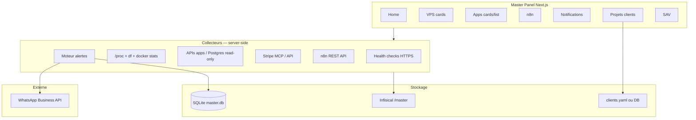

# Master Panel — TODO agent (`todoagent.md`)

> **Pour Cursor** : code, déploiement, intégrations MCP, docs techniques.  
> **Prérequis humains** : clés API (WhatsApp, n8n, Stripe), données clients initiales.  
> **URL prod** : https://master.pixelbrain.fr  
> **Repo** : `/Users/yaki/Documents/code/Master`  
> **VPS** : `51.210.11.46` · nginx `pixelbrain-nginx` · réseau `docker_ekowrk-network`

## Vision produit

Hub **solo** (Yaki) pour :

1. **Surveiller** VPS + apps + n8n en quasi temps réel (≤ 30 s)
2. **Être alerté sur WhatsApp** en cas de souci majeur
3. **Consulter l'historique** des alertes dans l'app
4. **Piloter** projets clients (URL, contacts, factures/docs)
5. **Préparer** le SAV multi-apps (phase ultérieure)

**Hors scope volontaire** : gestion VPS (restart container, SSH, etc.) — KPI et alertes uniquement.

---

## Légende

| Symbole | Signification |
|---------|---------------|
| ✅ | Livré et vérifié en prod |
| 🟡 | Partiel — base en place, données manquantes |
| ⬜ | À faire |
| 🔴 | Bloqué par prérequis humain |
| 🧱 | Dépend d'une autre tâche |

---

## Pages cibles (navigation sidebar)

| Route | Page | Priorité |
|-------|------|----------|
| `/` | **Home** — synthèse max d'infos utiles | P0 |
| `/vps` | **VPS** — cards par serveur (état, RAM, CPU, stockage) | P0 |
| `/apps` | **Apps** — cards/liste, status, users, revenus, détail au clic | P0 |
| `/n8n` | **n8n** — workflows actifs, running, avancement, PC IA local | P1 |
| `/notifications` | **Notifications** — historique alertes + statut WhatsApp | P0 |
| `/clients` | **Projets clients** — URL, contacts, factures/docs | P1 |
| `/sav` | **SAV** — tickets multi-apps | P2 |

---

## État actuel (23 juin 2026)

| Élément | Statut |
|---------|--------|
| Déploiement `master-web` Docker | ✅ |
| DNS + TLS `master.pixelbrain.fr` | ✅ |
| Auth mot de passe + anti brute-force | ✅ |
| Polling KPI 25 s | ✅ |
| Pages `/`, `/vps`, `/apps`, `/sav` (basique) | ✅ |
| CPU / disque VPS | ✅ |
| Users / revenus par app | 🟡 mock |
| Intégration n8n API | 🟡 stub si pas de clé |
| WhatsApp alertes | 🟡 stub log |
| Centre notifications in-app | ✅ |
| Projets clients | 🟡 exemple intégré |
| Page Home riche | ✅ |

---

## Architecture cible



---

## Sources de données par page

### Home

| KPI | Source | Dispo |
|-----|--------|-------|
| État global (OK / alerte) | Agrégation alertes + health | 🟡 |
| Apps up/down | Health checks | ✅ |
| Revenu MRR estimé | Stripe API (products + subs) | ⬜ 🔴 clé restreinte |
| Users total (toutes apps) | APIs admin par app | ⬜ |
| VPS RAM/CPU/disque | `/proc`, `df` | 🟡 RAM seulement |
| Dernières notifications | SQLite | ⬜ |
| Workflows n8n running | n8n API | ⬜ |
| Projets clients actifs | `clients.yaml` | ⬜ |

### VPS (cards)

| Champ card | Source |
|------------|--------|
| Nom / IP | Config statique (`51.210.11.46`) |
| État | Agrégation containers + ping |
| RAM % | `/host/proc/meminfo` ✅ |
| CPU % | `/proc/stat` delta 1s ⬜ |
| Stockage % | `df -h /` via exec ⬜ |
| Containers KO | `docker ps` ✅ |
| Uptime host | `/proc/uptime` ⬜ |

> **V1** : un seul VPS (`vps-main`). Structure prévue pour multi-VPS plus tard.

### Apps (cards + liste + détail)

| Champ | Source app | Notes |
|-------|------------|-------|
| Status | Health check HTTPS | ✅ |
| Users total | DB ou endpoint admin | ⬜ à créer par app |
| Users online | Redis/session ou WS count | ⬜ PixelbrainCard en priorité |
| Revenu (MRR / 30j) | Stripe (metadata `app_id`) | ⬜ |
| Latence | Health check | ✅ |

**Apps V1** : `pixelbraincard`, `echowork`, `ratus` (n8n et Infisical restent sur leurs pages dédiées).

**UI** : toggle Cards / Liste (persisté `localStorage`).

**Détail au clic** : drawer ou page `/apps/[id]` avec graph placeholder + métriques détaillées.

### n8n

| Champ | Source |
|-------|--------|
| Workflows actifs | `GET /api/v1/workflows?active=true` |
| Exécutions running | `GET /api/v1/executions?status=running` |
| Avancement | `execution.progress` / `startedAt` |
| PC IA local | Tag custom workflow ou variable env `AI_HOST` |

🔴 **Prérequis humain H-N8N-01** : créer une **API key n8n** (Settings → API) et la stocker dans Infisical `/master/prod` → `N8N_API_KEY`.

### Projets clients

| Champ | Source V1 |
|-------|-----------|
| Nom projet | `data/clients.json` (gitignored secrets refs) |
| URL prod/staging | YAML/JSON |
| Contacts (nom, email, tel) | JSON |
| Factures / docs | Liens Stripe invoices + URLs Google Drive / Notion |

🔴 **Prérequis humain H-CLIENT-01** : fournir la première liste clients (JSON ou saisie Infisical).

### Notifications

| Type | Déclencheur « majeur » |
|------|------------------------|
| `app_down` | App status `down` ≥ 2 min consécutives |
| `vps_critical` | RAM ≥ 90 % ou disque ≥ 90 % ou CPU ≥ 95 % (5 min) |
| `container_down` | Container critique unhealthy (api, postgres, nginx) |
| `n8n_failed` | Exécution workflow failed sur workflow tagué `critical` |

**Canaux** :
- WhatsApp (Meta Cloud API ou Twilio) → message court + lien master
- In-app → liste paginée, badge sidebar, marquer lu

---

## Phase 0 — Fondations ✅ (fait)

| ID | Tâche | Statut |
|----|-------|--------|
| M-00-01 | Repo Master + deploy Infisical | ✅ |
| M-00-02 | MCP Cursor (Stripe, OVH, Infisical) | ✅ |
| M-00-03 | App Next.js + auth + nginx + TLS | ✅ |
| M-00-04 | Health checks apps + docker ps | ✅ |
| M-00-05 | Sidebar + pages basiques | ✅ |
| M-00-06 | Sécurité (rate limit, honeypot, headers) | ✅ |
| M-00-07 | Polling 25 s | ✅ |
| M-00-08 | Deploy script (conserver .env existant) | ✅ |

---

## Phase 1 — Navigation & structure UI (P0)

**Objectif** : sidebar complète, routing, layout cohérent.

| ID | Tâche | Fichiers | Statut |
|----|-------|----------|--------|
| M-01-01 | Renommer `/` → Home explicite, enrichir copy | `app/(dashboard)/page.tsx` | ✅ |
| M-01-02 | Ajouter routes `/n8n`, `/notifications`, `/clients` | `app/(dashboard)/...` | ✅ |
| M-01-03 | Mettre à jour `Sidebar` (7 entrées + badge notifs) | `components/layout/Sidebar.tsx` | ✅ |
| M-01-04 | Composant `ViewToggle` cards/list pour Apps | `components/ui/ViewToggle.tsx` | ✅ |
| M-01-05 | Composant `DetailDrawer` réutilisable | `components/ui/DetailDrawer.tsx` | ✅ |
| M-01-06 | Design system minimal (Card, MetricRing, Sparkline placeholder) | `components/ui/*` | ✅ |

**Critère done** : toutes les pages accessibles, placeholders clairs, nav stable mobile.

---

## Phase 2 — Métriques VPS enrichies (P0)

**Objectif** : cards VPS avec RAM, CPU, stockage, état.

| ID | Tâche | Détail | Statut |
|----|-------|--------|--------|
| M-02-01 | Collector CPU % | Lire `/host/proc/stat`, calcul delta | ✅ |
| M-02-02 | Collector disque | `df -P /` → used/total % | ✅ |
| M-02-03 | Collector uptime | `/host/proc/uptime` | ✅ |
| M-02-04 | Types `VpsHostMetrics` | `lib/types.ts` | ✅ |
| M-02-05 | API `/api/metrics/vps` ou étendre `/api/metrics` | `lib/metrics.ts` | ✅ |
| M-02-06 | UI cards VPS | Jauge circulaire RAM/CPU/disk | ✅ |
| M-02-07 | Seuils visuels (vert / orange / rouge) | 70 / 85 % | ✅ |

**Fichiers** : `lib/metrics/vps.ts`, `app/(dashboard)/vps/page.tsx`

---

## Phase 3 — Métriques Apps + détail (P0)

**Objectif** : status, users, revenus ; clic → détail.

### 3A — Endpoints stats par app (🧱 apps existantes)

| ID | App | Endpoint proposé | Statut |
|----|-----|------------------|--------|
| M-03-01 | PixelbrainCard | `GET /api/admin/stats` (internal token) | ⬜ |
| M-03-02 | EchoWork | idem ou requête Postgres read-only | ⬜ |
| M-03-03 | Ratus | idem | ⬜ |

**Réponse type** :

```json
{
  "usersTotal": 1240,
  "usersOnline": 12,
  "revenueMrrCents": 89000,
  "revenue30dCents": 102400,
  "activeSubscriptions": 45
}
```

🔴 **H-APP-01** : token interne `MASTER_STATS_TOKEN` dans Infisical, exposé aux APIs apps via header `X-Master-Token`.

| ID | Tâche | Statut |
|----|-------|--------|
| M-03-04 | Module `lib/metrics/apps.ts` — fetch stats + merge health | 🟡 mock |
| M-03-05 | Stripe : MRR par app via metadata produit | 🟡 mock |
| M-03-06 | Page Apps : toggle cards/list | ✅ |
| M-03-07 | Card : status, users, €/mois | ✅ |
| M-03-08 | Page `/apps/[id]` ou drawer détail | ✅ drawer |
| M-03-09 | Graphiques users online (placeholder → vrai historique Phase 6) | ✅ placeholder |

---

## Phase 4 — n8n (P1)

| ID | Tâche | Statut |
|----|-------|--------|
| M-04-01 | Client `lib/integrations/n8n.ts` (API key depuis env) | ✅ |
| M-04-02 | Lister workflows actifs | ✅ |
| M-04-03 | Lister exécutions `running` + `failed` récentes | ✅ |
| M-04-04 | Afficher avancement (barre % si dispo) | 🟡 |
| M-04-05 | Champ `aiHost` via tag workflow `ai:mac-studio` ou note | ✅ |
| M-04-06 | Page `/n8n` UI | ✅ |
| M-04-07 | Widget résumé n8n sur Home | ✅ |

🔴 **H-N8N-01** : API key n8n  
🔴 **H-N8N-02** : Convention tags workflows (`critical`, `ai:hostname`)

---

## Phase 5 — Notifications WhatsApp + in-app (P0)

### 5A — Moteur d'alertes

| ID | Tâche | Statut |
|----|-------|--------|
| M-05-01 | SQLite `master.db` (volume Docker) | ✅ |
| M-05-02 | Table `notifications` (id, type, severity, title, body, sentWa, read, createdAt) | ✅ |
| M-05-03 | Table `alert_state` (dedup : pas re-alerter 30 min) | ✅ |
| M-05-04 | Job `lib/alerts/engine.ts` — évaluer règles après chaque collecte | ✅ |
| M-05-05 | Cron in-process (setInterval 25s) ou worker séparé | ✅ via polling metrics |

### 5B — WhatsApp

| Option | Coût | Recommandation |
|--------|------|----------------|
| **Meta WhatsApp Cloud API** | Gratuit tier limité | ✅ Recommandé |
| Twilio WhatsApp | Payant | Alternative |
| n8n → WhatsApp node | Dépend compte | Possible si déjà n8n |

| ID | Tâche | Statut |
|----|-------|--------|
| M-05-06 | `lib/integrations/whatsapp.ts` — envoi template | ✅ stub |
| M-05-07 | Template message : `{severity} {title} — {url}` | ✅ |
| M-05-08 | Config : `WHATSAPP_TOKEN`, `WHATSAPP_PHONE_ID`, `WHATSAPP_TO` (Infisical) | 🔴 H-WA-01 |

🔴 **H-WA-01** : Créer app Meta Business + numéro test/prod  
🔴 **H-WA-02** : Numéro Yaki en whitelist (mode dev)

### 5C — UI Notifications

| ID | Tâche | Statut |
|----|-------|--------|
| M-05-09 | API `GET /api/notifications`, `PATCH .../read` | ✅ |
| M-05-10 | Page `/notifications` — liste + filtres severity | ✅ |
| M-05-11 | Badge compteur non-lus dans sidebar | ✅ |
| M-05-12 | Widget « dernières alertes » sur Home | ✅ |

**Règles « majeur » V1** :

```typescript
const MAJOR_RULES = [
  { id: "app_down", when: (m) => m.apps.some(a => a.status === "down") },
  { id: "vps_ram", when: (m) => (m.vps.memoryPercent ?? 0) >= 90 },
  { id: "vps_disk", when: (m) => (m.vps.diskPercent ?? 0) >= 90 },
  { id: "nginx_down", when: (m) => !m.vps.containers.find(c => c.name === "pixelbrain-nginx")?.health === "up" },
];
```

---

## Phase 6 — Projets clients (P1)

| ID | Tâche | Statut |
|----|-------|--------|
| M-06-01 | Schéma `ClientProject` | ✅ |
| M-06-02 | Fichier `data/clients.json` (structure) + exemple | ✅ example |
| M-06-03 | API CRUD `/api/clients` (auth required) | 🟡 GET read |
| M-06-04 | Page `/clients` — cards avec URL, contacts | ✅ |
| M-06-05 | Section factures : lien Stripe invoice + upload doc (URL) | ✅ détail |
| M-06-06 | Page détail `/clients/[id]` | ✅ |
| M-06-07 | Sync optionnelle contacts depuis Stripe customers | ⬜ |

**Schéma V1** :

```json
{
  "id": "client-acme",
  "name": "Acme SAS",
  "projects": [
    {
      "name": "Site vitrine",
      "urls": { "prod": "https://acme.com", "staging": "https://staging.acme.com" },
      "appId": "pixelbraincard",
      "contacts": [{ "name": "Jean", "email": "j@acme.com", "phone": "+33..." }],
      "invoices": [{ "label": "Facture mars 2026", "url": "https://...", "stripeInvoiceId": "in_xxx" }],
      "docs": [{ "label": "Cahier des charges", "url": "https://drive.google.com/..." }]
    }
  ]
}
```

🔴 **H-CLIENT-01** : Remplir `clients.json` initial

---

## Phase 7 — Home « maximum d'infos » (P0)

| ID | Widget Home | Statut |
|----|-------------|--------|
| M-07-01 | Bandeau état global + compteur alertes non lues | ✅ |
| M-07-02 | KPI row : MRR total, users total, apps OK, VPS RAM | ✅ |
| M-07-03 | Grille apps compacte (status + users + €) | ✅ |
| M-07-04 | Mini VPS (CPU/RAM/disk gauges) | ✅ |
| M-07-05 | n8n : X running / Y failed 24h | ✅ |
| M-07-06 | Dernières 5 notifications | ✅ |
| M-07-07 | Projets clients récents (3) | ✅ |
| M-07-08 | Liens rapides (Infisical, Stripe, n8n, OVH) | ✅ |

---

## Phase 8 — SAV multi-apps (P2)

| ID | Tâche | Statut |
|----|-------|--------|
| M-08-01 | Modèle `Ticket` (appId, clientId, status, priority) | ⬜ |
| M-08-02 | UI liste + création ticket | ⬜ |
| M-08-03 | Intégration email entrant (Brevo / webhook) | ⬜ |
| M-08-04 | Lien ticket ↔ projet client | ⬜ |

---

## Phase 9 — Historique & polish (P2)

| ID | Tâche | Statut |
|----|-------|--------|
| M-09-01 | Historique métriques (SQLite time-series, 7 jours) | ⬜ |
| M-09-02 | Sparklines CPU/RAM/users sur cards | ⬜ |
| M-09-03 | Export PDF rapport hebdo (optionnel) | ⬜ |
| M-09-04 | Multi-VPS (structure config `vps[]`) | ⬜ |

---

## Prérequis humains (récap)

| ID | Action | Bloque |
|----|--------|--------|
| H-WA-01 | Compte Meta WhatsApp Business + token | Phase 5 WhatsApp |
| H-WA-02 | Numéro perso whitelist | Tests WA |
| H-N8N-01 | API key n8n → Infisical | Phase 4 |
| H-N8N-02 | Tags workflows n8n | Phase 4 PC IA |
| H-APP-01 | Token stats interne sur APIs apps | Phase 3 users/€ |
| H-CLIENT-01 | Liste projets clients initiale | Phase 6 |
| H-STRIPE-01 | Metadata `app_id` sur produits Stripe | Revenus par app |

---

## Ordre d'exécution recommandé (sprints)

### Sprint A (1–2 jours agent) — UI + VPS
- M-01-* (navigation complète)
- M-02-* (CPU, disk, cards VPS)
- M-07-01 à M-07-04 (Home partiel)

### Sprint B (2–3 jours) — Apps + stats
- H-APP-01 (humain) + M-03-* 
- H-STRIPE-01 (humain) + revenus Stripe
- M-07-05 à M-07-06

### Sprint C (2 jours) — Notifications
- M-05-* (SQLite + engine + WhatsApp + page)
- H-WA-* (humain)

### Sprint D (1–2 jours) — n8n + clients
- M-04-* + H-N8N-*
- M-06-* + H-CLIENT-*

### Sprint E — SAV + historique
- M-08-*, M-09-*

---

## Fichiers clés (cible)

```
Master/
├── todoagent.md                    ← ce fichier
├── data/
│   └── clients.json                ← projets clients (V1)
├── apps/master-web/
│   ├── app/(dashboard)/
│   │   ├── page.tsx                # Home
│   │   ├── vps/page.tsx
│   │   ├── apps/page.tsx
│   │   ├── apps/[id]/page.tsx
│   │   ├── n8n/page.tsx
│   │   ├── notifications/page.tsx
│   │   ├── clients/page.tsx
│   │   ├── clients/[id]/page.tsx
│   │   └── sav/page.tsx
│   ├── lib/
│   │   ├── metrics/
│   │   │   ├── vps.ts
│   │   │   ├── apps.ts
│   │   │   └── index.ts
│   │   ├── alerts/
│   │   │   ├── engine.ts
│   │   │   └── rules.ts
│   │   ├── integrations/
│   │   │   ├── n8n.ts
│   │   │   ├── whatsapp.ts
│   │   │   └── stripe.ts
│   │   └── db/
│   │       └── sqlite.ts
│   └── components/
│       ├── layout/Sidebar.tsx
│       └── ui/ViewToggle.tsx, DetailDrawer.tsx, ...
└── deploy/master-panel/
    └── docker-compose.yml          # + volume master-data
```

---

## Sécurité (rappels non négociables)

- Jamais de secrets dans Git — **Infisical** `/master/{dev,prod}`
- Tokens stats apps : header `X-Master-Token`, IP restrict optionnelle
- WhatsApp : envoi **uniquement** vers numéro Yaki
- n8n API key : read-only si possible
- Notifications : pas de PII client dans messages WA (titre + lien seulement)
- Rate limit login + API conservés

---

## Commandes utiles

```bash
# Déployer Master Panel (conserve le mot de passe existant)
./deploy/scripts/deploy-master-panel.sh

# Logs
ssh yaki@51.210.11.46 "docker logs master-web -f --tail 50"

# Mot de passe actuel (VPS)
ssh yaki@51.210.11.46 "grep MASTER_AUTH_PASSWORD /opt/Master/deploy/master-panel/.env"
```

---

## Notes agent

- **n8n** est sur le VPS (`n8n.pixelbrain.fr`) — API REST disponible avec clé.
- **Stripe** déjà connecté via MCP Cursor (mode live Pixel Brain).
- **Telegram** existe sur n8n — WhatsApp reste un canal séparé pour alertes Master.
- PixelbrainCard a Postgres : stats users nécessitent endpoint admin ou vue SQL read-only.
- Commencer Sprint A dès validation Yaki sur ce plan.
